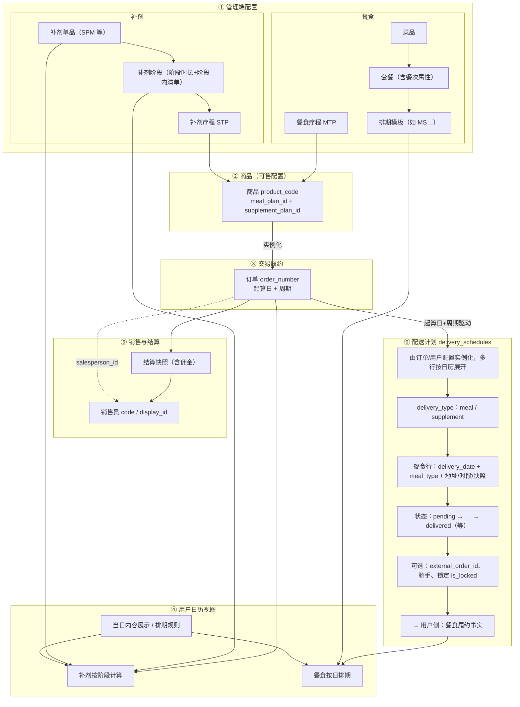

# 业务结构脑图：商品、排期与用户视图

与产品共识一致：**餐食疗程 MTP 不直连排期模板**；**补剂单品 + 补剂阶段** 共同支撑用户侧 **补剂按阶段计算**。**⑥ 配送计划** 为独立一块，由 **③ 订单** 驱动实例化，并输出到 **④ 餐食按日排期**。下图可粘贴到支持 Mermaid 的编辑器中渲染。

## 总览（六块：①～⑥）

## 配送计划（`delivery_schedules`）内部要点

| 维度 | 说明 |
|------|------|
| **粒度** | 多为「用户 × 日期 ×（餐次/类型）」一行；补剂可为 `delivery_type = supplement` 的履约行（与业务是否生成此类行一致）。 |
| **订单** | `order_id` 可关联订单；C 端先配后下单时历史上允许为空（以当前库迁移为准）。 |
| **餐食** | `meal_type`（breakfast/lunch/dinner）与 `delivery_date`、地址快照、时段字段共同描述「哪天哪餐送哪里」。 |
| **状态与锁定** | `status` 履约状态；`is_locked` / `locked_at`（治理迁移）用于控制变更窗口。 |
| **三方配送** | `external_order_id`、`delivery_provider`、骑手与坐标等用于对接外部运力。 |

## 与「排期模板」的边界

- **排期模板**（如 `meal_schedules` + `schedule_code` + `meal_schedule_entries`）：运营侧按日历配置的 **「哪天哪餐吃什么套餐/菜品」**；经 `active-meal-schedule` 等接口支撑用户侧 **内容展示**。
- **配送计划**（`meal_plan_config` + 表 `delivery_schedules` 餐食行）：用户/订单侧的 **履约槽位**——**用户信息、配送日、餐次、地址**（及时段快照、锁定 `is_locked` 等）；由用户配置配送计划、起算日与周期（及改址等）驱动，**不等于**疗程结构表，也 **不等于** 排期模板本身。

### 配送计划 vs 排期内容（职责分工，产品共识）

- **不要求**「模板里某天某餐有排期」与「用户表里同一天同餐有配送行」在数据上 **强制一行对一行**；二者分工不同。
- **吃什么（套餐、菜、热量等）**：以 **启用排期 / `meal_schedule_entries` → active-meal-schedule 链路** 为准。
- **送哪里、哪天送哪餐（履约事实）**：以 **`delivery_schedules`（及保存时的 `meal_plan_config`）** 为准。
- 治理重点是各界面 **勿混用数据源**（例如用配送行推断菜品），而非在库表层面强行对齐排期与配送行。

更细的走查项与代码落点见：**[P3-餐食与配置治理-检查清单.md](./P3-餐食与配置治理-检查清单.md)**。

---

*文档版本：与当前库 `delivery_schedules` 统一设计迁移（如 `20260324000000_unify_delivery_schedules.sql`）对齐描述；职责分工与 P3 清单同步。*
