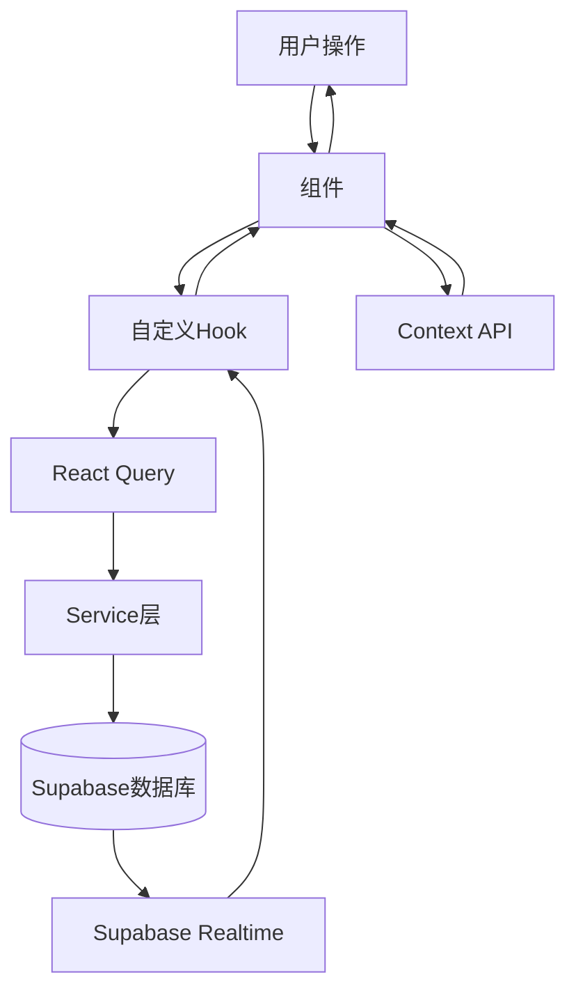
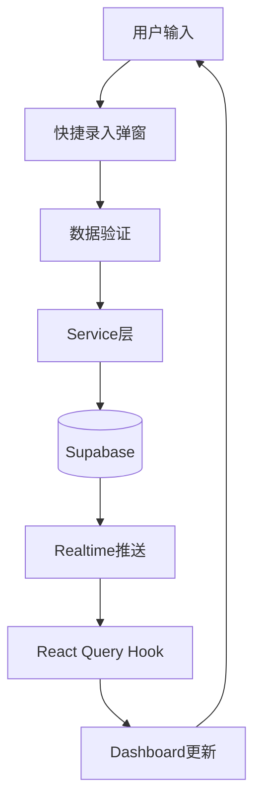
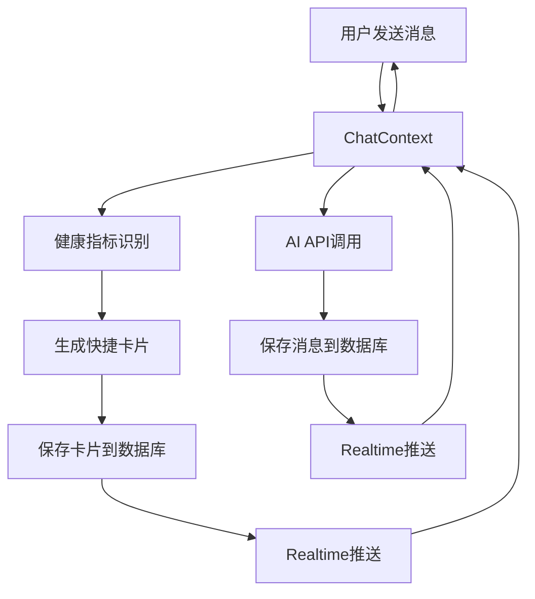

# 健康管理应用架构文档

> **版本**: 1.0  
> **最后更新**: 2025.12.17 16:35
> **维护者**: 开发团队

## 目录

1. [应用概览](#1-应用概览)
2. [导航结构](#2-导航结构)
3. [核心页面详细说明](#3-核心页面详细说明)
4. [配送计划流程](#4-配送计划流程)
5. [状态管理架构](#5-状态管理架构)
6. [数据流转图](#6-数据流转图)
7. [关键业务规则](#7-关键业务规则)
8. [页面组件清单](#8-页面组件清单)
9. [服务层清单](#9-服务层清单)
10. [关键操作流程](#10-关键操作流程)
11. [状态变化规则](#11-状态变化规则)
12. [错误处理](#12-错误处理)
13. [性能优化](#13-性能优化)
14. [用户流程](#14-用户流程)
15. [数据模型](#15-数据模型)
16. [API接口](#16-api接口)
17. [关键设计决策](#17-关键设计决策)
18. [注意事项](#18-注意事项)

---

## 1. 应用概览

### 1.1 应用类型

- **应用名称**: 健康管理移动应用
- **技术栈**: React + TypeScript
- **目标用户规模**: 10万用户
- **架构原则**: 保持简单，避免过度设计

### 1.2 技术栈

- **前端框架**: React 18+ with TypeScript
- **状态管理**: React Query + Context API（仅全局状态）
- **数据库**: Supabase (PostgreSQL)
- **实时通信**: Supabase Realtime
- **样式**: Tailwind CSS
- **构建工具**: Vite

### 1.3 目录结构

```
src/
├── api/              # Supabase配置和API客户端
├── components/       # React组件
│   ├── chat/        # 聊天相关组件
│   ├── common/      # 通用组件
│   ├── dashboard/   # 仪表盘组件
│   ├── delivery/    # 配送相关组件
│   ├── lazy/        # 懒加载组件
│   ├── meal/        # 餐食相关组件
│   ├── onboarding/  # 引导流程组件
│   └── supplement/  # 补剂相关组件
├── contexts/        # 全局状态（仅必要情况）
├── hooks/           # 自定义Hooks（基于React Query）
├── pages/           # 页面组件（已废弃，使用components）
├── services/        # 数据库操作
├── types/           # TypeScript类型定义
└── utils/           # 工具函数
```

---

## 2. 导航结构

### 2.1 主导航（currentScreen）

应用通过 `currentScreen` 在四主屏间切换（顶部栏等触发）；**不再使用已删除的 `BottomNav` 组件**。四主屏对应关系：

| 标签 | 路由键 | 屏幕组件 | 说明 |
|------|--------|----------|------|
| 首页 | `dashboard` | `Dashboard.tsx` | 健康数据仪表盘 |
| AI搭子 | `ai` | `AIChatScreen.tsx` | AI健康助手对话 |
| 套餐 | `mealplan` | `MealPlan.tsx` | 餐食计划管理 |
| 我的 | `profile` | `ProfileScreen.tsx` | 个人中心 |

### 2.2 屏幕路由

应用使用 `currentScreen` 状态控制主屏幕显示：

```typescript
type ScreenType = 'dashboard' | 'ai' | 'mealplan' | 'profile';
```

**路由逻辑**:
- `App.tsx` 维护 `currentScreen` 状态
- `AppHeader` 等与用户操作负责切换屏幕
- `AppRouter` 组件根据 `currentScreen` 渲染对应页面
- AI 对话界面底部为 **`AbilityBar`**（今日配送/餐/补剂/日反馈），非四 Tab 底栏

### 2.3 二级页面路由

二级页面通过独立的状态控制显示/隐藏，不在 `currentScreen` 中：

- **详情页**: 通过 `show*Screen` 状态控制（如 `showWeightDetailScreen`）
- **设置页**: 通过 `showProfileSettingsScreen` 状态控制
- **弹窗**: 通过 `useAppModals` Hook 管理

---

## 3. 核心页面详细说明

### 3.1 Dashboard（首页）

**文件**: `src/components/Dashboard.tsx`

#### 功能概述

Dashboard 是应用的主页面，展示用户的健康数据概览。

#### 主要功能

1. **健康数据卡片展示**
   - 体重、饮水、步数、运动、睡眠、血糖、情绪、营养等
   - 支持卡片拖拽排序
   - 支持卡片显示/隐藏

2. **快捷录入**
   - 点击卡片上的"+"按钮打开录入弹窗
   - 支持快速录入各项健康数据

3. **日期选择**
   - 顶部日期选择器
   - 支持查看不同日期的数据

4. **数据可视化**
   - 卡片显示当日数据
   - 点击卡片进入详情页查看历史数据

#### 状态管理

- **数据获取**: 使用 React Query Hooks
  - `useWeightRecordsQuery()`
  - `useWaterRecordsQuery()`
  - `useStepsRecordsQuery()`
  - `useSleepRecordsQuery()`
  - `useBloodGlucoseRecordsQuery()`
  - `useDashboardData()` - 综合数据

- **用户偏好**: 使用 `useAppPreferences` Hook
  - `dashboardCardOrder`: 卡片顺序
  - `hiddenDashboardCards`: 隐藏的卡片

- **日期管理**: 使用 `useCalendarLogic` Hook

#### 数据流转

```
用户操作 → Dashboard组件
  ↓
React Query Hooks → Services → Supabase
  ↓
Supabase Realtime → Hooks → Dashboard组件
  ↓
UI更新
```

#### 关键操作

| 操作 | 触发事件 | 结果 |
|------|----------|------|
| 点击卡片 | `onOpen*Detail()` | 打开对应详情页 |
| 点击"+"按钮 | 打开 `QuickEntryModals` | 显示录入弹窗 |
| 长按卡片 | `onOpenEditDashboard()` | 进入编辑模式 |
| 选择日期 | `onSelectedDateChange()` | 更新显示数据 |

#### Props接口

```typescript
interface DashboardProps {
  selectedDate: Date;
  displayedWeekStart: Date;
  data: DayData;
  dashboardCardOrder: string[];
  hiddenDashboardCards: string[];
  onSelectedDateChange: (date: Date) => void;
  onDisplayedWeekStartChange: (date: Date) => void;
  onUpdateDayData: (date: Date, updates: Partial<DayData>) => void;
  onOpenWeightDetail: () => void;
  onOpenWaterDetail: () => void;
  // ... 其他详情页回调
}
```

---

### 3.2 AIChatScreen（AI搭子）

**文件**: `src/components/AIChatScreen.tsx`

#### 功能概述

AI健康助手对话界面，用户可以与AI进行健康相关的对话。

#### 主要功能

1. **AI对话**
   - 发送消息获取AI回复
   - 支持消息历史记录
   - 实时消息更新

2. **健康指标识别**
   - 从用户消息中自动识别健康指标
   - 支持：体重、饮水、步数、运动、睡眠、血糖、情绪等
   - 识别后自动生成快捷录入卡片

3. **快捷录入卡片**
   - 自动生成快捷录入卡片
   - 用户确认后同步到健康记录表

4. **消息管理**
   - 清空今日对话
   - 清空全部对话
   - 加载历史消息

#### 状态管理

- **ChatContext**: 管理消息列表、加载状态
  - `messages`: 消息列表
  - `isLoadingAnalysis`: 分析中状态
  - `isSendingMessage`: 发送中状态
  - `conversationId`: 会话ID

- **useChatLogic**: 处理业务逻辑
  - `handleSendMessage()`: 发送消息
  - `handleQuickEntryConfirm()`: 确认快捷卡片

- **useChatMessagesQuery**: 管理消息数据（React Query）

#### 数据流转

```
用户输入消息
  ↓
healthMetricDetectionService 识别健康指标
  ↓
生成快捷卡片 → 保存到数据库
  ↓
调用 AI API → 获取回复
  ↓
保存消息到数据库
  ↓
Supabase Realtime 推送更新
  ↓
UI更新
```

#### 关键操作

| 操作 | 触发事件 | 结果 |
|------|----------|------|
| 发送消息 | `handleSendMessage()` | 识别指标 → 生成卡片 → 获取AI回复 |
| 确认快捷卡片 | `handleQuickEntryConfirm()` | 同步到健康记录表 |
| 清空对话 | `handleClearToday()` / `handleClearAll()` | 删除消息记录 |

#### 组件结构

```
AIChatScreen
  └── ChatProvider (Context)
      └── AIChatScreenContent
          ├── ChatMessageList (消息列表)
          ├── TextInput (输入框)
          └── QuickEntryCard (快捷卡片)
```

---

### 3.3 MealPlan（套餐）

**文件**: `src/components/MealPlan.tsx`

#### 功能概述

餐食计划管理页面，展示用户的餐食计划状态和配送计划。

#### 主要功能

1. **配送计划管理**
   - 显示配送计划状态（使用中/已过期）
   - 重新配置配送计划
   - 查看配送计划详情

2. **自定义报告卡片**
   - 查看健康报告
   - 重新评估

3. **自定义补剂卡片**
   - 查看补剂方案

4. **自定义餐食计划卡片**
   - 查看专属食谱

5. **其他食谱推荐**
   - 弹性素食减重食谱
   - 鱼素减脂食谱

#### 状态管理

- **UserProfileContext**: 
  - `mealPlanConfig`: 餐食计划配置
  - `mealPlanConfigured`: 是否已配置
  - `userPackage`: 用户套餐信息

- **本地状态**:
  - `deliveryPlanStatus`: 配送计划状态（'active' | 'expired'）
  - `showResetConfirmation`: 显示重置确认弹窗

#### 数据流转

```
MealPlan组件
  ↓
UserProfileContext → mealPlanConfig
  ↓
检查配置状态
  ↓
显示对应UI（已配置/未配置）
```

#### 关键操作

| 操作 | 触发事件 | 结果 |
|------|----------|------|
| 点击"我的配送计划" | `onOpenDeliveryPlan()` | 检查配置 → 已配置则打开DeliveryPlanPage，未配置则打开DateSelectionPage |
| 点击重置按钮 | `handleResetClick()` | 显示确认弹窗 → 确认后清除配置 |
| 点击"我的定制餐" | `onOpenCustomMealPlan()` | 打开CustomMealPlanScreen |

#### 配送计划状态判断

```typescript
// 检查配送计划状态
if (mealPlanConfig && mealPlanConfig.endDate) {
  const today = new Date();
  today.setHours(0, 0, 0, 0);
  const endDate = new Date(mealPlanConfig.endDate);
  endDate.setHours(0, 0, 0, 0);
  
  if (today <= endDate) {
    setDeliveryPlanStatus('active');
  } else {
    setDeliveryPlanStatus('expired');
  }
}
```

---

### 3.4 ProfileScreen（我的）

**文件**: `src/components/ProfileScreen.tsx`

#### 功能概述

个人中心页面，提供用户信息展示和设置入口。

#### 主要功能

1. **用户信息展示**
   - 用户头像、昵称
   - 用户ID（可复制）

2. **功能入口**
   - 我的订单
   - 收货地址
   - 我的报告
   - 我的设备
   - 设置
   - 隐私管理
   - 帮助与客服

3. **登录/登出**
   - 未登录显示登录按钮
   - 已登录显示退出登录

#### 状态管理

- **AuthContext**: 用户认证状态
  - `isAuthenticated`: 是否已登录

- **UserProfileContext**: 用户资料
  - `profile`: 用户资料数据

#### 数据流转

```
ProfileScreen
  ↓
AuthContext → isAuthenticated
UserProfileContext → profile
  ↓
根据状态显示UI
```

#### 关键操作

| 操作 | 触发事件 | 结果 |
|------|----------|------|
| 点击"我的订单" | `onOpenOrders()` | 打开MyOrdersScreen |
| 点击"收货地址" | `onOpenAddress()` | 打开AddDeliveryAddressPage |
| 点击"我的报告" | `onOpenReports()` | 打开MyReportsScreen |
| 点击"我的设备" | `onOpenDevices()` | 打开MyDevicesScreen |
| 点击"设置" | `onOpenSettings()` | 打开ProfileSettingsScreen |
| 点击"退出登录" | `signOut()` | 登出用户 |

#### 菜单结构

```typescript
const menuSections = [
  {
    items: [
      { id: 'orders', label: '我的订单', icon: Package },
      { id: 'address', label: '收货地址', icon: MapPin },
    ]
  },
  {
    items: [
      { id: 'reports', label: '我的报告', icon: FileText },
      { id: 'devices', label: '我的设备', icon: Watch },
    ]
  },
  {
    items: [
      { id: 'settings', label: '设置', icon: Settings },
      { id: 'privacy', label: '隐私管理', icon: Shield },
      { id: 'help', label: '帮助与客服', icon: HelpCircle },
    ]
  },
  // 登录用户显示退出登录
  ...(isAuthenticated ? [{
    items: [
      { id: 'logout', label: '退出登录', icon: LogOut },
    ]
  }] : [])
];
```

---

## 4. 配送计划流程

### 4.1 流程说明

配送计划配置是一个多步骤流程，根据用户是否已配置显示不同的流程。

#### 首次配置流程

```
1. DateSelectionPage（选择日期）
   ↓
2. MealPlanConfirmationModal（确认选择）
   ↓
3. AddDeliveryAddressPage（添加地址）
   ↓
4. DeliveryPlanPage（配置配送计划）
   ↓
5. 保存配置到数据库
```

#### 已配置流程

```
1. 检查 mealPlanConfig.selectedDates 是否存在且不为空
   ↓
2. 如果已配置：直接打开 DeliveryPlanPage
   ↓
3. 如果未配置：打开 DateSelectionPage
```

### 4.2 关键组件

#### DateSelectionPage

**文件**: `src/components/DateSelectionPage.tsx`

**功能**:
- 选择配送日期范围
- 选择餐次类型（早餐、午餐、晚餐）
- 排除特定日期

**状态**:
- `selectedDates`: 选中的日期数组
- `excludedDates`: 排除的日期数组
- `selectedMealTypes`: 选中的餐次类型

**关键操作**:
- 点击"下一步" → 打开 `MealPlanConfirmationModal`
- 确认后 → 打开 `AddDeliveryAddressPage`

#### AddDeliveryAddressPage

**文件**: `src/components/AddDeliveryAddressPage.tsx`

**功能**:
- 地址列表展示
- 添加/编辑/删除地址
- 选择默认地址

**状态管理**:
- 使用 `useAddressManagement` Hook
- 使用 `useAddressesQuery` Hook（React Query）

**关键操作**:
- 点击"完成" → 打开 `DeliveryPlanPage`
- 传递选中的地址ID

#### DeliveryPlanPage

**文件**: `src/components/DeliveryPlanPage.tsx`

**功能**:
- 显示配送计划表格（日期 × 餐次）
- 编辑每餐的配送地址
- 锁定/解锁配送计划
- 确认生成配送计划

**关键状态**:
- `dateMealConfigs`: 日期-餐次-地址配置数组
- `lockedMeals`: 已锁定的餐次集合
- `mealAddresses`: 餐次地址映射（保存到 localStorage）

**数据流转**:
- 配置保存到 `meal_plan_config_data` (user_profiles 表)
- 地址映射保存到 localStorage (`mealAddresses`)

**关键操作**:
- 点击地址单元格 → 打开地址选择弹窗
- 点击锁定按钮 → 锁定/解锁餐次
- 点击"确认生成配送计划" → 保存配置

### 4.3 配置检查逻辑

在 `App.tsx` 中的 `handleOpenDeliveryPlanFromMealPlan` 函数：

```typescript
const handleOpenDeliveryPlanFromMealPlan = async () => {
  // 直接从 service 获取配置，确保获取最新数据
  const { data: { user } } = await supabase.auth.getUser();
  const effectiveUserId = user?.id || null;
  const configFromService = await getMealPlanConfig(effectiveUserId);
  
  // 检查是否已有配置的配送计划（selectedDates 不为空）
  const hasValidConfig = configFromService && 
                        configFromService.selectedDates && 
                        configFromService.selectedDates.length > 0;
  
  if (hasValidConfig) {
    // 直接打开配送计划页面
    setTempSelectedDates(configFromService.selectedDates);
    setTempSelectedMealTypes(configFromService.selectedMealTypes);
    setTempSelectedAddressId(configFromService.deliveryAddressId || '');
    setIsOpenedFromDeliveryPlan(true);
    setShowDeliveryPlanPage(true);
  } else {
    // 显示日期选择页面
    setShowDateSelectionPage(true);
  }
};
```

### 4.4 重置配送计划

**操作流程**:
1. 用户点击重置按钮
2. 显示确认弹窗
3. 确认后调用 `resetMealPlanConfig()`
4. 清除所有配置数据
5. 返回初始状态

**清除的数据**:
- `selectedDates`
- `selectedMealTypes`
- `excludedDates`
- `deliveryAddressId`
- `dateMealConfigs`
- `lockedMeals`

---

## 5. 状态管理架构

### 5.1 Context层

应用使用 Context API 管理全局状态，仅用于必要的全局状态：

#### AuthContext

**文件**: `src/contexts/AuthContext.tsx`

**功能**: 用户认证状态管理

**状态**:
- `isAuthenticated`: 是否已登录
- `user`: 当前用户信息
- `loading`: 加载状态

**方法**:
- `signIn()`: 登录
- `signOut()`: 登出
- `signUp()`: 注册

#### UserProfileContext

**文件**: `src/contexts/UserProfileContext.tsx`

**功能**: 用户资料和套餐配置管理

**状态**:
- `profile`: 用户资料
- `userPackage`: 用户套餐信息
- `mealPlanConfig`: 餐食计划配置
- `mealPlanConfigured`: 是否已配置餐食计划

**方法**:
- `refreshProfile()`: 刷新用户资料
- `refreshMealPlanConfig()`: 刷新餐食计划配置
- `resetMealPlanConfig()`: 重置餐食计划配置

#### ChatContext

**文件**: `src/contexts/ChatContext.tsx`

**功能**: 聊天消息状态管理

**状态**:
- `messages`: 消息列表
- `inputText`: 输入文本
- `isLoadingAnalysis`: 分析中状态
- `isSendingMessage`: 发送中状态
- `conversationId`: 会话ID

**方法**:
- `handleSendMessage()`: 发送消息
- `handleQuickEntryConfirm()`: 确认快捷卡片
- `handleClearToday()`: 清空今日对话
- `handleClearAll()`: 清空全部对话

#### OnboardingContext

**文件**: `src/contexts/OnboardingContext.tsx`

**功能**: 引导流程状态管理

**状态**:
- 引导流程进度
- 用户输入的数据

### 5.2 Hooks层

应用使用自定义 Hooks 封装业务逻辑，基于 React Query 进行数据管理：

#### 应用级 Hooks

- **useAppOnboarding**: 引导流程状态管理
- **useAppNavigation**: 导航状态管理
- **useAppMealPlan**: 餐食计划状态管理
- **useAppModals**: 弹窗状态管理
- **useAppPreferences**: 用户偏好管理
- **useAppFoodDetail**: 食物详情状态管理

#### 数据查询 Hooks（React Query）

- **useWeightRecordsQuery**: 体重记录查询
- **useWaterRecordsQuery**: 饮水记录查询
- **useStepsRecordsQuery**: 步数记录查询
- **useSleepRecordsQuery**: 睡眠记录查询
- **useBloodGlucoseRecordsQuery**: 血糖记录查询
- **useExerciseRecordsQuery**: 运动记录查询
- **useMeasurementsRecordsQuery**: 身体测量记录查询
- **useFoodRecordsQuery**: 食物记录查询
- **useChatMessagesQuery**: 聊天消息查询
- **useAddressesQuery**: 地址查询
- **useUserProfileQuery**: 用户资料查询
- **useHealthAssessmentQuery**: 健康评估查询

#### 业务逻辑 Hooks

- **useChatLogic**: 聊天业务逻辑
- **useDashboardData**: 仪表盘数据聚合
- **useCalendarLogic**: 日历逻辑
- **useAddressManagement**: 地址管理逻辑
- **useDeliveryPlanLock**: 配送计划锁定逻辑
- **useDateSelection**: 日期选择逻辑

### 5.3 React Query层

所有数据查询使用 React Query 进行管理：

**优势**:
- 自动缓存
- 自动刷新
- 并行查询优化
- 错误处理
- 加载状态管理

**配置**:
- `staleTime`: 5分钟（默认）
- `cacheTime`: 10分钟（默认）
- 自动重试：3次

### 5.4 Services层

Services 层直接操作 Supabase，无中间抽象层：

**架构规范**: 组件 → Hook → Supabase（最多3层）

**服务列表**:
- `weightService.ts`: 体重记录服务
- `waterService.ts`: 饮水记录服务
- `stepsService.ts`: 步数记录服务
- `sleepService.ts`: 睡眠记录服务
- `bloodGlucoseService.ts`: 血糖记录服务
- `exerciseService.ts`: 运动记录服务
- `measurementsService.ts`: 身体测量服务
- `emotionService.ts`: 情绪记录服务
- `addressService.ts`: 地址管理服务
- `mealPlanConfigService.ts`: 餐食计划配置服务
- `chatMessagesService.ts`: 聊天消息服务
- `healthMetricDetectionService.ts`: 健康指标识别服务
- `quickEntrySyncService.ts`: 快捷录入同步服务
- `dailyStatisticsService.ts`: 每日统计服务
- `dashboardDataService.ts`: 仪表盘数据服务

---

## 6. 数据流转图

### 6.1 整体数据流



### 6.2 健康数据录入流程



### 6.3 AI对话流程



---

## 7. 关键业务规则

### 7.1 配送计划规则

1. **已配置的配送计划**: 直接显示，不显示日期选择
2. **未配置的配送计划**: 显示日期选择 → 地址选择 → 配送计划配置
3. **重置后**: 清除所有配置，返回初始状态
4. **状态判断**: 根据 `endDate` 判断配送计划是否过期

### 7.2 健康指标识别规则

1. **自动识别**: 从用户消息中自动识别健康指标
2. **支持类型**: 体重、饮水、步数、运动、睡眠、血糖、情绪、围度等
3. **识别后**: 自动生成快捷录入卡片
4. **匹配优先级**: 优先匹配更长的词（如"不开心"优先于"开心"）

### 7.3 数据隔离规则

1. **用户数据隔离**: 所有 localStorage 数据按用户ID隔离
2. **用户切换**: 用户切换时自动清除旧用户数据
3. **工具函数**: 使用 `userStorage` 工具函数确保隔离

### 7.4 卡片显示规则

1. **卡片顺序**: 使用 `dashboardCardOrder` 控制
2. **隐藏卡片**: 使用 `hiddenDashboardCards` 控制
3. **拖拽排序**: 支持用户自定义卡片顺序
4. **持久化**: 卡片顺序和隐藏状态保存到 localStorage

### 7.5 日期选择规则

1. **默认日期**: 显示今天的数据
2. **日期切换**: 切换日期时自动加载对应日期的数据
3. **周视图**: 支持查看一周的数据
4. **日历选择**: 支持通过日历选择日期

---

## 8. 页面组件清单

### 8.1 主要页面

| 组件 | 文件路径 | 说明 |
|------|----------|------|
| Dashboard | `components/Dashboard.tsx` | 主仪表盘 |
| AIChatScreen | `components/AIChatScreen.tsx` | AI对话界面 |
| MealPlan | `components/MealPlan.tsx` | 餐食计划主页面 |
| ProfileScreen | `components/ProfileScreen.tsx` | 个人中心 |
| LoginPage | `components/LoginPage.tsx` | 登录页面 |
| AbilityBar | `components/singlepage/AbilityBar.tsx` | 对话主界面底部能力条 |

### 8.2 详情页

| 组件 | 文件路径 | 说明 |
|------|----------|------|
| WeightDetailScreen | `components/WeightDetailScreen.tsx` | 体重详情 |
| WaterDetailScreen | `components/WaterDetailScreen.tsx` | 饮水详情 |
| StepsDetailScreen | `components/StepsDetailScreen.tsx` | 步数详情 |
| SleepDetailScreen | `components/SleepDetailScreen.tsx` | 睡眠详情 |
| BloodGlucoseDetailScreen | `components/BloodGlucoseDetailScreen.tsx` | 血糖详情 |
| MeasurementsDetailScreen | `components/MeasurementsDetailScreen.tsx` | 身体测量详情 |
| ExerciseDetailScreen | `components/ExerciseDetailScreen.tsx` | 运动详情 |
| ExerciseStatsDetailScreen | `components/ExerciseStatsDetailScreen.tsx` | 运动统计详情 |
| HealthRingsDetailScreen | `components/HealthRingsDetailScreen.tsx` | 健康圆环详情 |
| NutritionDetailScreen | `components/NutritionDetailScreen.tsx` | 营养详情 |

### 8.3 餐食计划相关

| 组件 | 文件路径 | 说明 |
|------|----------|------|
| CustomMealPlanScreen | `components/CustomMealPlanScreen.tsx` | 自定义餐食计划 |
| MealPlanDetailScreen | `components/MealPlanDetailScreen.tsx` | 单日餐食详情 |
| DateSelectionPage | `components/DateSelectionPage.tsx` | 配送日期选择 |
| DeliveryPlanPage | `components/DeliveryPlanPage.tsx` | 配送计划详情 |
| AddDeliveryAddressPage | `components/AddDeliveryAddressPage.tsx` | 配送地址管理 |
| MealPlanConfirmationModal | `components/MealPlanConfirmationModal.tsx` | 餐食计划确认弹窗 |

### 8.4 个人中心相关

| 组件 | 文件路径 | 说明 |
|------|----------|------|
| ProfileSettingsScreen | `components/ProfileSettingsScreen.tsx` | 个人资料设置 |
| MyReportsScreen | `components/MyReportsScreen.tsx` | 我的报告列表 |
| MyOrdersScreen | `components/MyOrdersScreen.tsx` | 我的订单列表 |
| MyDevicesScreen | `components/MyDevicesScreen.tsx` | 我的设备管理 |
| MyHealthProfileScreen | `components/MyHealthProfileScreen.tsx` | 我的健康档案 |
| CustomReportScreen | `components/CustomReportScreen.tsx` | 定制健康报告详情 |
| CustomSupplementScreen | `components/CustomSupplementScreen.tsx` | 定制补剂方案详情 |

### 8.5 引导流程页面

| 组件 | 文件路径 | 说明 |
|------|----------|------|
| OnboardingFlow | `components/onboarding/OnboardingFlow.tsx` | 引导流程主控制器 |
| WelcomePage | `components/onboarding/WelcomePage.tsx` | 欢迎页 |
| GenderSelectionPage | `components/onboarding/GenderSelectionPage.tsx` | 性别选择页 |
| AboutYouPages | `components/onboarding/AboutYouPages.tsx` | 关于你的信息收集 |
| BodyDataPages | `components/onboarding/BodyDataPages.tsx` | 身体数据收集 |
| GoalSelectionPage | `components/onboarding/GoalSelectionPage.tsx` | 健康目标选择 |
| HealthReportPage | `components/onboarding/HealthReportPage.tsx` | 健康评估报告页 |
| NutritionSolutionPage | `components/onboarding/NutritionSolutionPage.tsx` | 营养方案推荐页 |

### 8.6 其他功能

| 组件 | 文件路径 | 说明 |
|------|----------|------|
| EmotionJarScreen | `components/EmotionJarScreen.tsx` | 情绪罐页面 |
| EditDashboardScreen | `components/EditDashboardScreen.tsx` | 编辑仪表盘 |
| AISettingsScreen | `components/AISettingsScreen.tsx` | AI助手设置 |
| DailyStatisticsScreen | `components/DailyStatisticsScreen.tsx` | 每日统计 |
| HealthReportView | `components/HealthReportView.tsx` | 健康报告查看 |
| RecipeIntroScreen | `components/RecipeIntroScreen.tsx` | 菜谱介绍页面 |

---

## 9. 服务层清单

### 9.1 健康数据服务

| 服务 | 文件路径 | 主要功能 |
|------|----------|----------|
| weightService | `services/weightService.ts` | 体重记录CRUD |
| waterService | `services/waterService.ts` | 饮水记录CRUD |
| stepsService | `services/stepsService.ts` | 步数记录CRUD |
| sleepService | `services/sleepService.ts` | 睡眠记录CRUD |
| bloodGlucoseService | `services/bloodGlucoseService.ts` | 血糖记录CRUD |
| exerciseService | `services/exerciseService.ts` | 运动记录CRUD |
| measurementsService | `services/measurementsService.ts` | 身体测量记录CRUD |
| emotionService | `services/emotionService.ts` | 情绪记录CRUD |

### 9.2 业务服务

| 服务 | 文件路径 | 主要功能 |
|------|----------|----------|
| addressService | `services/addressService.ts` | 地址管理CRUD |
| mealPlanConfigService | `services/mealPlanConfigService.ts` | 餐食计划配置管理 |
| deliveryPlanService | `services/deliveryPlanService.ts` | 配送计划管理 |
| chatMessagesService | `services/chatMessagesService.ts` | 聊天消息CRUD |
| healthMetricDetectionService | `services/healthMetricDetectionService.ts` | 健康指标识别 |
| quickEntrySyncService | `services/quickEntrySyncService.ts` | 快捷录入同步 |
| dailyStatisticsService | `services/dailyStatisticsService.ts` | 每日统计 |
| dashboardDataService | `services/dashboardDataService.ts` | 仪表盘数据聚合 |
| userProfileService | `services/userProfileService.ts` | 用户资料管理 |
| healthAssessmentService | `services/healthAssessmentService.ts` | 健康评估 |
| foodService | `services/foodService.ts` | 食物数据管理 |
| nutritionSyncService | `services/nutritionSyncService.ts` | 营养数据同步 |

### 9.3 工具服务

| 服务 | 文件路径 | 主要功能 |
|------|----------|----------|
| localStorageService | `services/localStorageService.ts` | localStorage管理 |
| userPreferencesService | `services/userPreferencesService.ts` | 用户偏好管理 |
| errorHandler | `services/errorHandler.ts` | 错误处理 |
| calorieCalculations | `services/calorieCalculations.ts` | 卡路里计算 |

---

## 10. 关键操作流程

### 10.1 配送计划配置流程

**流程图**:

```
1. 用户点击"配送计划"
   ↓
2. 检查 mealPlanConfig.selectedDates 是否存在且不为空
   ↓
3a. 如果已配置：
   - 直接打开 DeliveryPlanPage
   - 显示已配置的计划
   ↓
3b. 如果未配置：
   - 打开 DateSelectionPage
   - 用户选择日期和餐次
   ↓
4. 打开 MealPlanConfirmationModal 确认
   ↓
5. 打开 AddDeliveryAddressPage
   - 用户添加/选择地址
   ↓
6. 打开 DeliveryPlanPage
   - 用户配置每餐的配送地址
   - 锁定/解锁餐次
   ↓
7. 确认生成配送计划
   - 保存配置到数据库
   - 更新 UserProfileContext
```

### 10.2 AI对话流程

**流程图**:

```
1. 用户输入消息
   ↓
2. healthMetricDetectionService 识别健康指标
   ↓
3. 如果有指标：
   - 生成快捷卡片
   - 保存到数据库
   ↓
4. 调用 AI API 获取回复
   ↓
5. 保存消息到数据库
   ↓
6. Supabase Realtime 推送更新
   ↓
7. ChatContext 更新消息列表
   ↓
8. UI 更新显示新消息
```

### 10.3 快捷录入流程

**流程图**:

```
1. 用户点击快捷录入按钮
   ↓
2. 打开录入弹窗（QuickEntryModals）
   ↓
3. 用户输入数据
   ↓
4. 数据验证
   ↓
5. 调用对应的 Service 保存数据
   ↓
6. React Query 自动刷新数据
   ↓
7. Dashboard 自动更新显示
```

### 10.4 健康数据详情查看流程

**流程图**:

```
1. 用户在 Dashboard 点击卡片
   ↓
2. 调用 onOpen*Detail() 回调
   ↓
3. 设置 show*DetailScreen = true
   ↓
4. 渲染对应的 DetailScreen 组件
   ↓
5. DetailScreen 使用 React Query Hook 加载数据
   ↓
6. 显示历史数据和图表
```

---

## 11. 状态变化规则

### 11.1 屏幕切换

- **主屏幕**: 通过 `currentScreen` 状态控制
  - `'dashboard'`: 首页
  - `'ai'`: AI搭子
  - `'mealplan'`: 套餐
  - `'profile'`: 我的

- **二级页面**: 通过独立的 `show*Screen` 状态控制
  - 详情页：`showWeightDetailScreen`, `showWaterDetailScreen` 等
  - 设置页：`showProfileSettingsScreen`
  - 其他：`showReportsScreen`, `showOrdersScreen` 等

### 11.2 弹窗管理

- **统一管理**: 所有弹窗状态由 `useAppModals` Hook 管理
- **打开/关闭**: 统一的打开/关闭接口
- **层级控制**: 支持多个弹窗同时打开（通过 z-index 控制层级）

### 11.3 数据更新

- **React Query**: 自动管理缓存和刷新
- **Supabase Realtime**: 实时推送更新
- **本地状态**: 同步更新本地状态

### 11.4 用户偏好更新

- **卡片顺序**: 拖拽排序后保存到 localStorage
- **隐藏卡片**: 切换显示/隐藏后保存到 localStorage
- **用户隔离**: 所有偏好数据按用户ID隔离

---

## 12. 错误处理

### 12.1 网络错误

- **统一错误提示**: 使用 `AlertDialog` 组件显示错误
- **离线状态检测**: 检测网络状态，显示离线提示
- **数据保存**: 临时保存到 localStorage（待网络恢复后同步）

### 12.2 数据验证

- **表单验证**: 所有表单输入进行验证
- **数据类型检查**: TypeScript 类型检查
- **边界值处理**: 处理边界值（如负数、超大值等）

### 12.3 错误边界

- **ErrorBoundary**: 使用 React ErrorBoundary 捕获组件错误
- **错误日志**: 记录错误日志到控制台
- **友好提示**: 显示友好的错误提示给用户

### 12.4 服务错误

- **Supabase 错误**: 统一处理 Supabase 错误
- **API 错误**: 统一处理 API 错误
- **重试机制**: 自动重试失败的请求（最多3次）

---

## 13. 性能优化

### 13.1 代码分割

- **React.lazy**: 大型组件使用 React.lazy 按需加载
- **LazyComponents**: `LazyComponents.tsx` 统一管理懒加载组件
- **Suspense**: 使用 Suspense 显示加载状态

### 13.2 数据优化

- **React Query 缓存**: 使用 React Query 缓存策略
- **并行查询**: 并行查询多个数据源
- **防抖/节流**: 对频繁操作进行防抖/节流处理

### 13.3 渲染优化

- **React.memo**: 使用 React.memo 优化组件
- **useMemo/useCallback**: 优化计算和回调函数
- **避免不必要的重渲染**: 合理使用依赖数组

### 13.4 数据库优化

- **索引**: 所有查询字段建立索引
- **查询优化**: 避免全表扫描
- **分页**: 大数据量使用分页查询

---

## 14. 用户流程

### 14.1 新用户流程

```
1. 打开应用
   ↓
2. 显示登录页面
   ↓
3. 用户登录/注册
   ↓
4. 检查是否完成引导流程
   ↓
5. 如果未完成：
   - 显示 OnboardingFlow
   - 收集用户信息
   - 生成健康报告
   - 推荐营养方案
   ↓
6. 进入 Dashboard
   ↓
7. 开始使用应用
```

### 14.2 已配置用户流程

```
1. 打开应用
   ↓
2. 自动登录（如果有session）
   ↓
3. 进入 Dashboard
   ↓
4. 查看健康数据
   ↓
5. 使用AI助手
   ↓
6. 查看餐食计划
   ↓
7. 管理个人设置
```

### 14.3 引导流程详细步骤

```
1. WelcomePage（欢迎页）
   ↓
2. GenderSelectionPage（性别选择）
   ↓
3. AboutYouPages（关于你的信息）
   - 年龄、身高、职业等
   ↓
4. BodyDataPages（身体数据）
   - 当前体重、目标体重等
   ↓
5. GoalSelectionPage（健康目标选择）
   ↓
6. HealthReportPage（健康评估报告）
   ↓
7. NutritionSolutionPage（营养方案推荐）
   ↓
8. 完成引导，进入 Dashboard
```

---

## 15. 数据模型

### 15.1 用户数据

#### user_profiles 表

| 字段 | 类型 | 说明 |
|------|------|------|
| id | UUID | 主键 |
| user_id | UUID | 用户ID（关联 auth.users） |
| nickname | TEXT | 昵称 |
| current_weight | DECIMAL | 当前体重 |
| target_weight | DECIMAL | 目标体重 |
| height | DECIMAL | 身高 |
| meal_plan_config_data | JSONB | 餐食计划配置 |
| created_at | TIMESTAMPTZ | 创建时间 |
| updated_at | TIMESTAMPTZ | 更新时间 |

#### auth.users 表

Supabase 内置表，存储用户认证信息。

### 15.2 健康数据

#### weight_records 表

| 字段 | 类型 | 说明 |
|------|------|------|
| id | UUID | 主键 |
| user_id | UUID | 用户ID |
| value | DECIMAL | 体重值 |
| recorded_at | TIMESTAMPTZ | 记录时间 |
| created_at | TIMESTAMPTZ | 创建时间 |

#### water_records 表

| 字段 | 类型 | 说明 |
|------|------|------|
| id | UUID | 主键 |
| user_id | UUID | 用户ID |
| amount | INTEGER | 饮水量（ml） |
| recorded_at | TIMESTAMPTZ | 记录时间 |
| created_at | TIMESTAMPTZ | 创建时间 |

#### exercise_records 表

| 字段 | 类型 | 说明 |
|------|------|------|
| id | UUID | 主键 |
| user_id | UUID | 用户ID |
| exercise_type | TEXT | 运动类型 |
| duration | INTEGER | 持续时间（分钟） |
| calories | INTEGER | 消耗卡路里 |
| recorded_at | TIMESTAMPTZ | 记录时间 |
| created_at | TIMESTAMPTZ | 创建时间 |

#### emotion_records 表

| 字段 | 类型 | 说明 |
|------|------|------|
| id | UUID | 主键 |
| user_id | UUID | 用户ID |
| emotion | TEXT | 情绪类型 |
| recorded_at | TIMESTAMPTZ | 记录时间 |
| created_at | TIMESTAMPTZ | 创建时间 |

#### health_records 表

通用健康记录表，用于存储各种健康数据。

### 15.3 聊天数据

#### chat_messages 表

| 字段 | 类型 | 说明 |
|------|------|------|
| id | UUID | 主键 |
| user_id | UUID | 用户ID |
| conversation_id | UUID | 会话ID |
| type | TEXT | 消息类型（'user' | 'ai'） |
| content | TEXT | 消息内容 |
| created_at | TIMESTAMPTZ | 创建时间 |

### 15.4 配送数据

#### delivery_addresses 表

| 字段 | 类型 | 说明 |
|------|------|------|
| id | UUID | 主键 |
| user_id | UUID | 用户ID |
| label | TEXT | 地址标签 |
| address | TEXT | 详细地址 |
| contact_name | TEXT | 联系人姓名 |
| phone | TEXT | 联系电话 |
| is_default | BOOLEAN | 是否默认地址 |
| created_at | TIMESTAMPTZ | 创建时间 |
| updated_at | TIMESTAMPTZ | 更新时间 |

---

## 16. API接口

### 16.1 AI接口

| 接口 | 方法 | 说明 |
|------|------|------|
| `/api/ai/chat` | POST | AI对话 |
| `/api/ai/health-report` | POST | 健康报告生成 |
| `/api/ai/glucose-analysis` | POST | 血糖分析 |
| `/api/ai/personalized-plan` | POST | 个性方案 |

### 16.2 用户接口

| 接口 | 方法 | 说明 |
|------|------|------|
| `/api/users/profile` | GET | 获取用户资料 |
| `/api/users/profile` | PUT | 更新用户资料 |

---

## 17. 关键设计决策

### 17.1 架构原则

1. **保持简单**: 避免过度设计，代码易于理解、调试和维护
2. **最多3层抽象**: 组件 → Hook → Supabase
3. **使用 React Query**: 不使用 Redux，使用 React Query 管理数据
4. **Context 仅用于全局状态**: 仅必要的全局状态使用 Context

### 17.2 数据管理

1. **React Query**: 所有数据通过 React Query 管理
2. **Supabase Realtime**: 实时更新通过 Supabase Realtime
3. **本地缓存**: 使用 React Query 内置缓存，不自定义缓存策略

### 17.3 组件设计

1. **单一职责**: 每个组件只负责一个功能
2. **组件大小限制**: 函数≤50行，组件≤200行
3. **TypeScript**: 使用 TypeScript 确保类型安全

### 17.4 性能优化

1. **按需加载**: 大型组件使用 React.lazy
2. **合理使用 memo**: 避免不必要的重渲染
3. **数据库索引**: 所有查询字段建立索引

---

## 18. 注意事项

### 18.1 容器宽度

- **默认宽度**: 所有新增容器、页面的默认宽度应该是app默认容器的宽度
- **不要全屏宽度**: 避免使用全屏宽度

### 18.2 数据隔离

- **用户隔离**: 所有 localStorage 数据必须按用户ID隔离
- **工具函数**: 使用 `userStorage` 工具函数确保隔离

### 18.3 错误处理

- **统一错误提示**: 使用统一的错误提示组件
- **友好错误信息**: 显示友好的错误信息给用户
- **离线状态提示**: 检测离线状态并提示用户

### 18.4 性能要求

- **组件优化**: 使用 React.lazy 按需加载
- **合理使用 memo**: 避免不必要的重渲染
- **数据库索引**: 所有查询字段建立索引
- **避免过度渲染**: 合理使用依赖数组

### 18.5 代码质量

- **函数长度**: 函数≤50行
- **组件长度**: 组件≤200行
- **类型完整**: 所有函数和组件都有完整的类型定义
- **错误处理**: 所有异步操作都有错误处理

---

## 附录

### A. 常用工具函数

- `userStorage`: 用户数据隔离存储
- `formatDate`: 日期格式化
- `calculateBMR`: BMR计算
- `calculateStepsData`: 步数数据计算

### B. 常用组件

- `AlertDialog`: 提示弹窗
- `ConfirmModal`: 确认弹窗
- `LoadingState`: 加载状态
- `ErrorBoundary`: 错误边界

### C. 开发工具

- `DevToolsPanel`: 开发工具面板
- React DevTools
- Supabase Dashboard

---

**文档结束**


